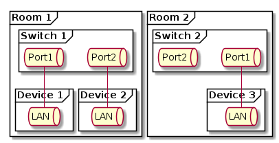

# net-uml-draw

[](https://travis-ci.org/j3p0uk/net-uml-draw) [](https://pypi.org/project/net-uml-draw/)

Write PlantUML from a Google Sheets spreadsheet for a simple home network diagram

## Spreadsheet Example

|Display Name and Port                             |Room  |Device  |Port |MAC|Connect|Display Name|
|--------------------------------------------------|------|--------|-----|---|-------|------------|
|=CONCATENATE(if(ISBLANK(G2),C2,G2), " Port: ", D2)|Room 1|Switch 1|Port1|   |=A4    |            |
|=CONCATENATE(if(ISBLANK(G3),C3,G3), " Port: ", D3)|Room 1|Switch 1|Port2|   |=A5    |            |
|=CONCATENATE(if(ISBLANK(G4),C4,G4), " Port: ", D4)|Room 1|Device 1|LAN  |   |=A2    |            |
|=CONCATENATE(if(ISBLANK(G5),C5,G5), " Port: ", D5)|Room 1|Device 2|LAN  |   |=A3    |            |
|=CONCATENATE(if(ISBLANK(G6),C6,G6), " Port: ", D6)|Room 2|Switch 2|Port1|   |=A8    |            |
|=CONCATENATE(if(ISBLANK(G7),C7,G7), " Port: ", D7)|Room 2|Switch 2|Port2|   |       |            |
|=CONCATENATE(if(ISBLANK(G8),C8,G8), " Port: ", D8)|Room 2|Device 3|LAN  |   |=A6    |            |

## Sample PlantUML

```
@startuml
frame "Room 1" as 1 {
    frame "Switch 1" as 2 {
        queue "Port1" as 3
        queue "Port2" as 4
    }
    frame "Device 1" as 5 {
        queue "LAN" as 6
    }
    frame "Device 2" as 7 {
        queue "LAN" as 8
    }
}
frame "Room 2" as 9 {
    frame "Switch 2" as 10 {
        queue "Port1" as 11
        queue "Port2" as 12
    }
    frame "Device 3" as 13 {
        queue "LAN" as 14
    }
}
3 -- 6
4 -- 8
11 -- 14
@enduml
```

## Running PlantUML

```
java -DPLANTUML_LIMIT_SIZE=8192 -jar plantuml.1.2020.7.jar ./home_network.puml
```

## Sample Diagram


